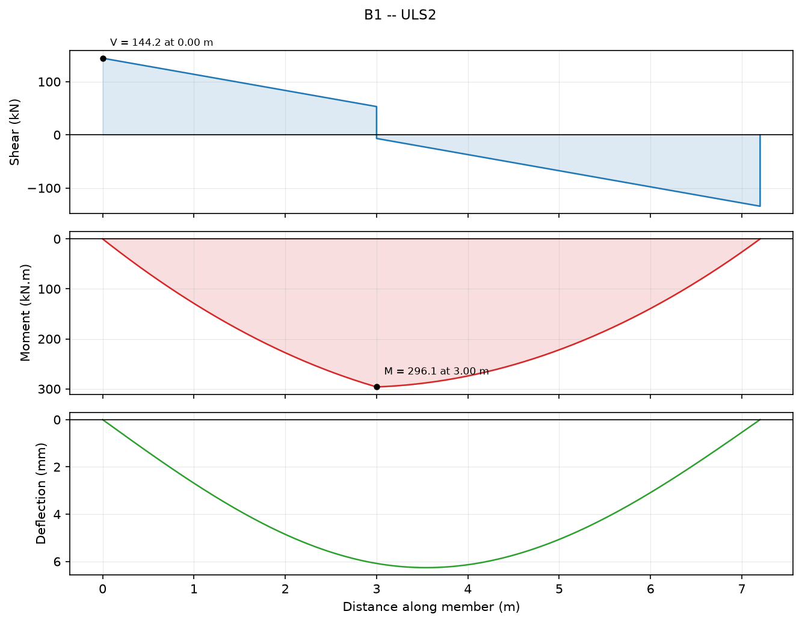
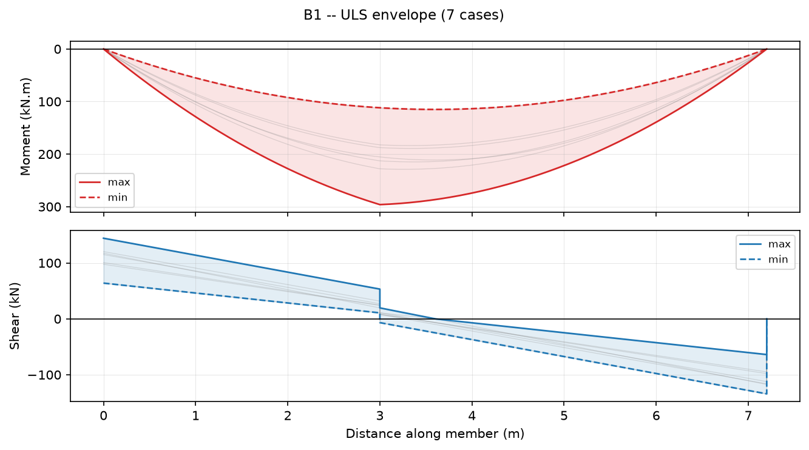
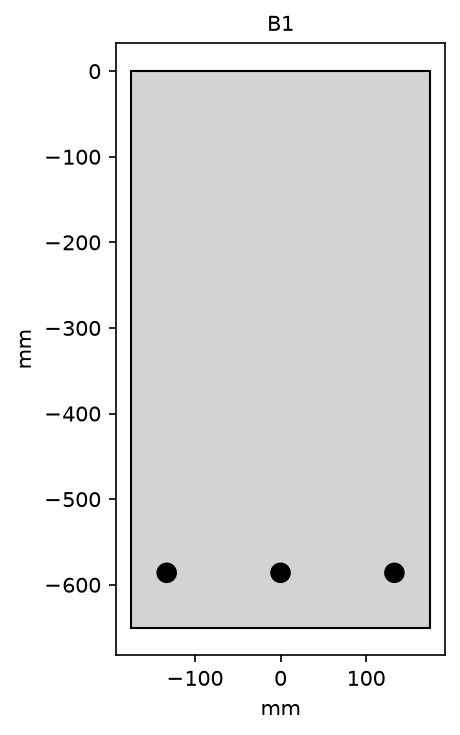

# Roof beam B1 -- Northbank Depot

**Job:** 25-0142 &nbsp;|&nbsp; **Project:** Northbank Depot &nbsp;|&nbsp; **Element:** Roof beam B1 &nbsp;|&nbsp; **Revision:** A

**Result: PASS**

> **NOT FOR ISSUE.** One or more modules used in this calculation have not been verified against the printed standard by a named checker. See the provenance block at the end of each section.

Simply supported roof beam, 7.2 m clear span, 350 x 650 | C32 | COV 40 | BOT 3-N24 | LIG N12-2L@250. Demands enveloped over 7 ultimate combinations to AS/NZS 1170.0; capacities to AS 3600:2018.

Simply supported roof beam, 7.2 m clear span, 350 x 650 | C32 | COV 40 | BOT 3-N24 | LIG N12-2L@250. Demands enveloped over 7 ultimate combinations to AS/NZS 1170.0; capacities to AS 3600:2018.

### Scope

> **SCOPE**
>
> Flexural and shear strength of B1 at the ultimate limit state only. Deflection, crack control, anchorage and the supporting blockwork are outside this calculation.

### Assumptions

> **ASSUMPTION**
>
> Permanent action 5.22 kPa over a 3.6 m tributary width, plus beam self weight at 24 kN/m3. Imposed action 0.25 kPa (AS/NZS 1170.1 Table 3.2, non-trafficable roof) with a 40 kN plant load at 3.0 m. Ultimate wind uplift 3.98 kN/m from V_des = 41.0 m/s to AS/NZS 1170.2.

## 1. Enveloped demands -- B1 (ULS)

**Inputs**

| Symbol | Description | Value | Unit |
|---|---|---:|---|
| `n` | Combinations analysed | 7 | - |

**Basis**

- First principles -- Linear elastic analysis, results enveloped over load combinations
- AS/NZS 1170.0:2002 Cl 4.2.2 -- Combinations for ultimate limit states
- AS/NZS 1170.0:2002 Cl 4.2.2 -- Combinations for ultimate limit states
- AS/NZS 1170.0:2002 Cl 4.2.2 -- Combinations for ultimate limit states
- AS/NZS 1170.0:2002 Cl 4.2.2 -- Combinations for ultimate limit states
- AS/NZS 1170.0:2002 Cl 4.2.2 -- Combinations for ultimate limit states
- AS/NZS 1170.0:2002 Cl 4.2.2 -- Combinations for ultimate limit states
- AS/NZS 1170.0:2002 Cl 4.2.2 -- Combinations for ultimate limit states

**Validity envelope**

Status: WITHIN


**Results**

| Symbol | Description | Value | Unit |
|---|---|---:|---|
| `M*_sag` | Governing sagging moment [ULS2] | 296.1 | kN.m |
| `M*_hog` | Governing hogging moment [ULS1] | 0 | kN.m |
| `V*` | Governing shear [ULS2] | 144.2 | kN |
| `delta` | Maximum deflection [ULS2] | 6.263 | mm |
| `R_A` | Maximum reaction [ULS2] | 144.2 | kN |
| `R_B` | Maximum reaction [ULS2] | 134.2 | kN |

<details><summary>Provenance</summary>

```
Module:      austruct.analysis.envelope v0.1.0
Type:        B (B_PER_JOB)
ASET:        3 -- Fast demand calculation
Author:      A. Morrison
Status:      UNVERIFIED
Checked by:  NOT CHECKED
Vectors:     0 registered
Run at:      2026-09-03T18:54:44+00:00
WARNING:     This module is not verified for issue. Results are for development use only.
```

</details>



*Shear, moment and deflection under the governing combination (ULS2)*



*Moment and shear envelopes over all ULS combinations*

## 2. Flexural strength check -- AS 3600:2018 Cl 8.1

**Inputs**

| Symbol | Description | Value | Unit |
|---|---|---:|---|
| `f'c` | Concrete strength | 32 | MPa |
| `D` | Overall depth | 650 | mm |
| `b` | Compression face width | 350 | mm |
| `A_s1` | 3-N24 at d = 586 mm | 1357 | mm^2 |
| `M*` | Design bending moment | 296.1 | kN.m |

**Basis**

- AS 3600:2018 Cl 8.1.2 -- Ultimate strength in bending
- AS 3600:2018 Cl 8.1.3 -- Rectangular stress block
- AS 3600:2018 Table 2.2.2 -- Capacity reduction factors
- AS 3600:2018 Cl 8.1.5 -- Ductility limit on k_uo
- AS 3600:2018 Cl 8.1.6.1 -- Minimum strength requirement

**Validity envelope**

Status: WITHIN

- 20 <= f'c <= 100 MPa  [actual 32]  OK
- 20 <= f'c <= 100 MPa  [actual 32]  OK
- 1800 <= density <= 2800 kg/m^3  [actual 2400]  OK
- NOTE: Non-prestressed reinforced concrete only. No axial force.
- NOTE: Sagging bending with the compression face at the top of the section as supplied. Model hogging by inverting the section.
- NOTE: Torsion, lateral instability of slender beams and the effects of sustained load are not considered.

**Working**

| Symbol | Description | Value | Unit |
|---|---|---:|---|
| `alpha_2` | Stress block intensity | 0.85 | - |
| `gamma` | Stress block depth ratio | 0.826 | - |
| `d_n` | Neutral axis depth | 86.3 | mm |
| `gamma.d_n` | Stress block depth | 71.28 | mm |
| `d` | Effective depth | 586 | mm |
| `d_o` | Depth to outermost tensile layer | 586 | mm |
| `k_u` | d_n / d | 0.1473 | - |
| `k_uo` | d_n / d_o | 0.1473 | - |
| `z` | Lever arm | 550.4 | mm |
| `C_c` | Concrete compressive force | 6.786e+05 | N |
| `T_s` | Tensile force in reinforcement | 6.786e+05 | N |
| `A_st` | Tensile steel area | 1357 | mm^2 |
| `M_cr` | Cracking moment | 91.31 | kN.m |

**Results**

| Symbol | Description | Value | Unit |
|---|---|---:|---|
| `phi` | Capacity reduction factor (Class N) | 0.85 | - |
| `M_uo` | Nominal moment capacity | 373.5 | kN.m |
| `phi.M_uo` | Design moment capacity | 317.4 | kN.m |

**Checks**

| Criterion | Actual | Limit | Utilisation | Result | Basis |
|---|---:|---:|---:|:---:|---|
| Ductility, k_uo | 0.1473 - | <= 0.36 - | 0.409 | PASS | AS 3600:2018 Cl 8.1.5 |
| Minimum strength, M_uo >= 1.2 M_cr | 373.5 kN.m | >= 109.6 kN.m | 0.293 | PASS | AS 3600:2018 Cl 8.1.6.1 |
| Flexural strength, M* <= phi.M_uo | 296.1 kN.m | <= 317.4 kN.m | 0.933 | PASS | AS 3600:2018 Cl 2.2.2 |

<details><summary>Provenance</summary>

```
Module:      austruct.design.as3600.flexure v0.1.0
Type:        B (B_PER_JOB)
ASET:        5 -- Design verification
Author:      A. Morrison
Status:      UNVERIFIED
Checked by:  NOT CHECKED
Vectors:     0 registered
Run at:      2026-09-03T18:54:44+00:00
WARNING:     This module is not verified for issue. Results are for development use only.
```

</details>

## 3. Shear strength check -- AS 3600:2018 Cl 8.2 (simplified method)

**Inputs**

| Symbol | Description | Value | Unit |
|---|---|---:|---|
| `f'c` | Concrete strength | 32 | MPa |
| `b_v` | Effective web width | 350 | mm |
| `D` | Overall depth | 650 | mm |
| `d` | Effective depth | 586 | mm |
| `A_st` | Tensile reinforcement area | 1357 | mm^2 |
| `A_sv/s` | Fitments: N12-2leg @ 250 | 0.9048 | mm^2/mm |
| `V*` | Design shear force | 126.4 | kN |

**Basis**

- AS 3600:2018 Cl 8.2.1.1 -- Design shear strength
- AS 3600:2018 Cl 8.2.1.9 -- Effective shear depth d_v
- AS 3600:2018 Cl 8.2.1.7 -- Minimum shear reinforcement
- AS 3600:2018 Cl 8.2.4.2 -- Simplified method for k_v and theta_v
- AS 3600:2018 Cl 8.2.4.1 -- Concrete shear contribution
- AS 3600:2018 Cl 8.2.3.3 -- Web crushing limit V_u,max
- AS 3600:2018 Table 2.2.2 -- Capacity reduction factors

**Validity envelope**

Status: WITHIN

- 20 <= f'c <= 100 MPa  [actual 32]  OK
- NOTE: Non-prestressed reinforced concrete. No axial force, no torsion.
- NOTE: Vertical fitments only (alpha_v = 90 degrees).
- NOTE: Shear friction across construction joints, and shear in the vicinity of concentrated loads within 2d of a support, are not considered.

**Working**

| Symbol | Description | Value | Unit |
|---|---|---:|---|
| `d_v` | Effective shear depth | 527.4 | mm |
| `d_o` | Depth to outermost tensile bar | 586 | mm |
| `(A_sv/s)_min` | Minimum shear reinforcement | 0.3168 | mm^2/mm |
| `k_v` | Concrete shear factor (simplified, >= minimum fitments) | 0.15 | - |
| `theta_v` | Compression strut angle | 36 | deg |
| `V_uc + V_us` | Before the V_u,max cap | 485 | kN |

**Results**

| Symbol | Description | Value | Unit |
|---|---|---:|---|
| `V_uc` | Concrete contribution | 156.6 | kN |
| `V_us` | Fitment contribution | 328.4 | kN |
| `V_u,max` | Web crushing limit | 1545 | kN |
| `V_u` | Nominal shear capacity | 485 | kN |
| `phi` | Capacity reduction factor, shear | 0.7 | - |
| `phi.V_u` | Design shear capacity | 339.5 | kN |

**Checks**

| Criterion | Actual | Limit | Utilisation | Result | Basis |
|---|---:|---:|---:|:---:|---|
| Minimum shear reinforcement, A_sv/s | 0.9048 mm^2/mm | >= 0.3168 mm^2/mm | 0.350 | PASS | AS 3600:2018 Cl 8.2.1.7 |
| Shear strength, V* <= phi.V_u | 126.4 kN | <= 339.5 kN | 0.372 | PASS | AS 3600:2018 Cl 2.2.2 |

<details><summary>Provenance</summary>

```
Module:      austruct.design.as3600.shear v0.1.0
Type:        B (B_PER_JOB)
ASET:        5 -- Design verification
Author:      A. Morrison
Status:      UNVERIFIED
Checked by:  NOT CHECKED
Vectors:     0 registered
Run at:      2026-09-03T18:54:44+00:00
WARNING:     This module is not verified for issue. Results are for development use only.
```

</details>



*Section as detailed*

### Conclusion

> **CONCLUSION**
>
> B1 as detailed (350 x 650 | C32 | COV 40 | BOT 3-N24 | LIG N12-2L@250) is adequate in flexure (utilisation 0.93) and in shear (utilisation 0.37) at the ultimate limit state.

## Signatures

| | Name | Date |
|---|---|---|
| Designed | A. Morrison | 2026-09-03 |
| Checked | &nbsp; | &nbsp; |
